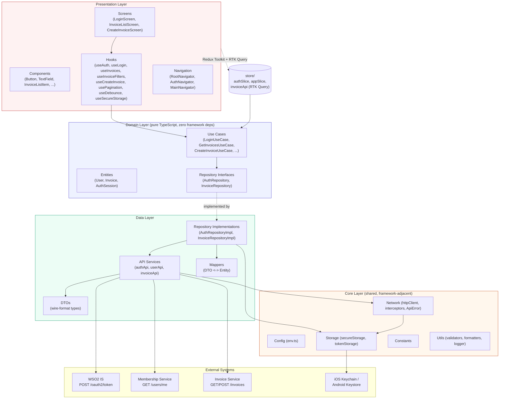
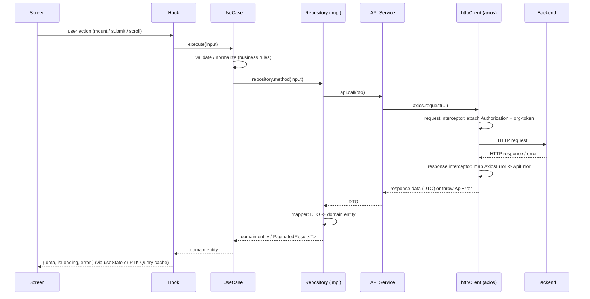
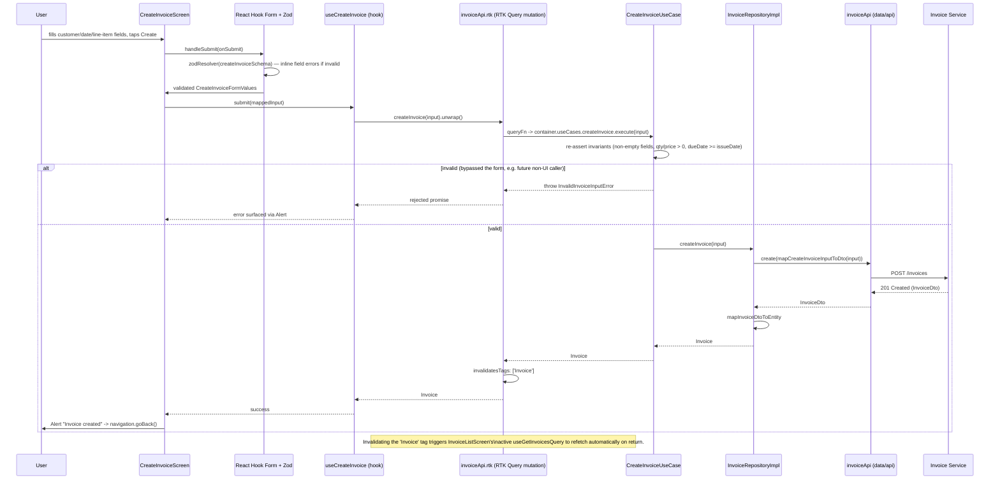
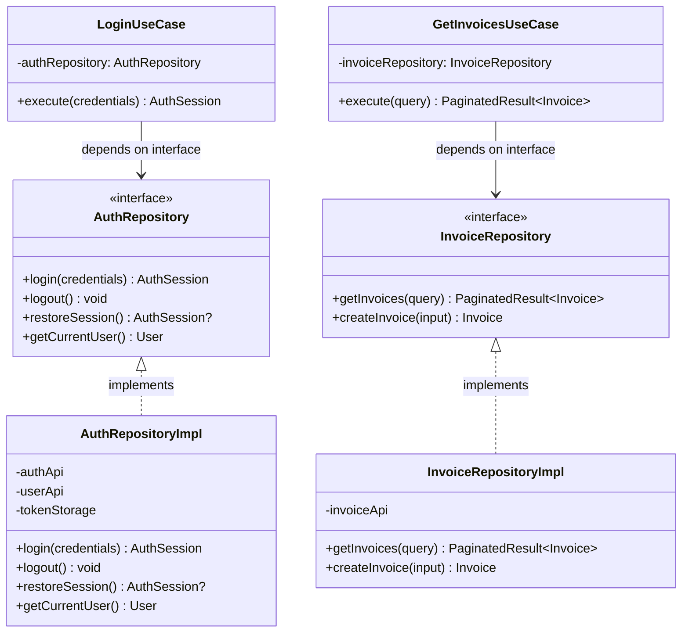
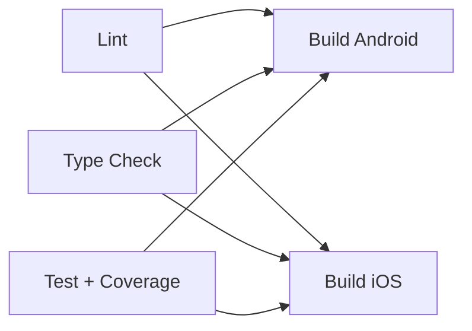

# ARCHITECTURE.md — SimpleInvoice

Staff-level architecture reference: layers, dependency rules, diagrams, and
the concrete flows for the two features that exercise every layer (login,
create invoice).

---

## 1. High-Level Architecture Diagram



**Dependency direction (enforced, not just documented):**

```text
Presentation  →  Domain  →  Data  →  External APIs
     ↑              ↑
     └────── Core (shared utility, imported by all layers) ──────┘
```

- `domain/` imports **nothing** from `data/` or `presentation/`, and only
  framework-free helpers from `core/` (`core/utils/validators.ts`,
  `core/types`). It has zero React, zero Axios, zero Redux imports —
  verified by `tests/unit/usecases/*` running the use cases with hand-rolled
  mock repositories, no React Native runtime required.
- `data/` implements domain's repository **interfaces** (Dependency
  Inversion) and is the only layer allowed to import Axios, DTOs, or
  Keychain/EncryptedStorage.
- `presentation/` never imports `data/` directly. Hooks call
  `domain/usecases` (via the composition root in `src/app/di/container.ts`)
  or `store/` (Redux Toolkit slices / RTK Query, which themselves only call
  use cases — see §7).
- `core/` has no upward imports; it's imported by all three layers, never
  the other way around.

---

## 2. Detailed Folder Structure

```text
SimpleInvoice/
├── src/
│   ├── app/                        # Composition root — wires everything together
│   │   ├── App.tsx                 # App entry: providers + RootNavigator
│   │   ├── di/container.ts         # Manual DI: repositories -> use cases
│   │   └── providers/AppProviders.tsx  # Redux Provider, SafeAreaProvider,
│   │                                    # sessionEvents -> Redux bridge
│   │
│   ├── presentation/                # Everything that renders or reacts to UI state
│   │   ├── screens/
│   │   │   ├── Login/               # LoginScreen, schema.ts (Zod), styles
│   │   │   ├── InvoiceList/         # InvoiceListScreen + components/
│   │   │   └── CreateInvoice/       # CreateInvoiceScreen, schema.ts (Zod)
│   │   ├── components/common/       # Button, TextField, LoadingIndicator, ErrorView
│   │   ├── hooks/                   # useAuth, useLogin, useInvoices,
│   │   │                            # useInvoiceFilters, useCreateInvoice,
│   │   │                            # usePagination, useDebounce, useSecureStorage
│   │   └── navigation/              # RootNavigator, AuthNavigator, MainNavigator
│   │
│   ├── domain/                      # Pure business logic — the app's real "core"
│   │   ├── entities/                # User, Invoice, Auth (framework-free types)
│   │   ├── repositories/            # AuthRepository, InvoiceRepository (interfaces)
│   │   └── usecases/
│   │       ├── auth/                # LoginUseCase, LogoutUseCase, RestoreSessionUseCase
│   │       └── invoice/             # GetInvoicesUseCase, CreateInvoiceUseCase
│   │
│   ├── data/                        # Adapters that satisfy domain's interfaces
│   │   ├── api/                     # authApi, userApi, invoiceApi (axios calls)
│   │   ├── dto/                     # Wire-format types (snake_case, server-owned)
│   │   ├── mappers/                 # DTO <-> domain entity translation
│   │   └── repositories/            # AuthRepositoryImpl, InvoiceRepositoryImpl
│   │
│   ├── core/                        # Cross-cutting, framework-adjacent infrastructure
│   │   ├── config/env.ts            # react-native-config wrapper, fails fast if unset
│   │   ├── constants/               # API paths, storage keys, app constants
│   │   ├── network/                 # httpClient (axios), interceptors, ApiError,
│   │   │                            # sessionEvents (pub/sub, decouples core from store)
│   │   ├── storage/                 # secureStorage (Keychain/EncryptedStorage),
│   │   │                            # tokenStorage (the ONLY token read/write path)
│   │   ├── utils/                   # validators, formatters, logger
│   │   └── types/                   # common.types.ts, api.types.ts
│   │
│   ├── store/                       # Redux Toolkit (client state) + RTK Query (server state)
│   │   ├── slices/                  # authSlice, appSlice
│   │   ├── api/invoiceApi.rtk.ts    # RTK Query endpoints, queryFn delegates to use cases
│   │   ├── hooks.ts                 # typed useAppDispatch / useAppSelector
│   │   └── index.ts                 # store configuration
│   │
│   └── types/env.d.ts               # react-native-config module augmentation
│
├── tests/
│   ├── unit/                        # usecases/, hooks/, utils/ — no RN runtime needed
│   ├── component/                   # LoginScreen, InvoiceListScreen (RNTL)
│   └── integration/                 # invoiceApi.integration.test.ts (mocked HTTP layer)
│
├── .github/workflows/ci.yml         # lint -> typecheck -> test -> build (android/ios)
├── .env.example / .env.development / .env.staging / .env.production
├── .gitignore
├── package.json / tsconfig.json / babel.config.js / metro.config.js / jest.config.js
├── README.md / ARCHITECTURE.md (this file) / DECISIONS.md
```

### Folder responsibilities

| Folder | Responsibility | May import from |
|---|---|---|
| `app/` | Composition root: builds the dependency graph, mounts providers | domain, data, presentation, store, core |
| `presentation/screens` | Screen-level layout, form wiring, navigation triggers | presentation/hooks, presentation/components, domain entities (types only) |
| `presentation/components` | Dumb, reusable UI primitives | React Native only — no hooks that touch domain/data |
| `presentation/hooks` | Bridges UI and business logic; owns UI-only state (debounce, pagination cursor) | domain/usecases, store, core (read-only) |
| `presentation/navigation` | Route trees, auth-gated stack switching | presentation/screens, presentation/hooks (`useAuth`) |
| `domain/entities` | App-shape data structures | nothing (leaf) |
| `domain/repositories` | Interfaces (ports) the data layer must satisfy | domain/entities |
| `domain/usecases` | Business rules, orchestration, invariant enforcement | domain/entities, domain/repositories, core/utils |
| `data/api` | One HTTP call per method, zero business logic | core/network, data/dto |
| `data/dto` | Wire-format shapes exactly matching the backend contract | nothing (leaf) |
| `data/mappers` | DTO ⇄ entity translation, the one place field-name drift is absorbed | data/dto, domain/entities |
| `data/repositories` | Implements domain interfaces; orchestrates multi-call flows (login) | data/api, data/mappers, core/storage, domain |
| `core/config` | Environment/build-time configuration | react-native-config |
| `core/network` | Axios instance, interceptors, error mapping, session-expired event bus | core/storage, core/config, core/utils |
| `core/storage` | Secure-at-rest key/value access (Keychain/EncryptedStorage) | react-native-keychain, react-native-encrypted-storage |
| `core/constants` | Magic strings/numbers, named once | nothing |
| `core/utils` | Framework-free helpers (validators, formatters, logger) | core/config (logger only) |
| `core/types` | Shared structural types (`PaginatedResult<T>`, etc.) | nothing |
| `store/` | Redux Toolkit slices for client state; RTK Query for server-state caching | domain/usecases (via `app/di/container`), core |
| `tests/` | Unit, component, and integration test suites, mirroring `src/` | everything, as needed per test |

---

## 3. Data Flow Diagram (generic read/write request)



No arrow skips a layer. `Screen → API Service` or `Hook → axios` calls do
not exist anywhere in the codebase — see `src/presentation/**` for the
absence of any `axios`/`fetch` import.

---

## 4. Authentication Sequence

```mermaid
sequenceDiagram
    participant U as User
    participant LS as LoginScreen
    participant UL as useLogin (hook)
    participant AS as authSlice (Redux thunk)
    participant LU as LoginUseCase
    participant AR as AuthRepositoryImpl
    participant AA as authApi
    participant UA as userApi
    participant TS as tokenStorage (Keychain)
    participant WSO2 as WSO2 IS /oauth2/token
    participant MS as Membership /users/me

    U->>LS: enters username/password, taps Sign in
    LS->>LS: React Hook Form + Zod validate
    LS->>UL: submit({ username, password })
    UL->>AS: dispatch(login(credentials))
    AS->>LU: execute(credentials)
    LU->>LU: guard: non-empty username/password
    LU->>AR: login(credentials)
    AR->>AA: requestToken(credentials)
    AA->>WSO2: POST /oauth2/token (form-encoded, grant_type=password)
    WSO2-->>AA: { access_token, ... }
    AR->>UA: getCurrentUser(access_token)  Note: explicit header, not interceptor
    UA->>MS: GET /users/me  (Authorization: Bearer access_token)
    MS-->>UA: { memberships: [{ token: org_token, ... }], ... }
    AR->>AR: orgToken = memberships[0].token
    AR->>TS: save({ accessToken, orgToken })
    TS->>TS: Keychain.setGenericPassword (WHEN_UNLOCKED_THIS_DEVICE_ONLY)
    AR-->>LU: AuthSession { user, accessToken, orgToken }
    LU-->>AS: AuthSession
    AS->>AS: state.user = session.user; isAuthenticated = true
    AS-->>LS: (via useAppSelector) isAuthenticated flips
    LS->>LS: RootNavigator swaps AuthNavigator -> MainNavigator
    Note over LS: InvoiceListScreen is the default landing screen
```

**Session restoration** (cold start) follows the same
`AuthRepositoryImpl.restoreSession()` path: read tokens from Keychain, call
`GET /users/me` with the stored `accessToken` to confirm the session is
still valid, and either return the reconstructed `AuthSession` or clear the
Keychain entry and fall through to `LoginScreen`.

**Secure logout**: `LogoutUseCase → AuthRepositoryImpl.logout() →
tokenStorage.clear()`, which resets the Keychain entry AND removes the
cached user profile from encrypted storage — nothing token-related survives
in any storage layer after logout.

**401 mid-session**: `core/network`'s response interceptor maps any 401 to
`ApiError.UNAUTHORIZED` and emits on `sessionEvents`; `AppProviders`'
`SessionExpiredBridge` is subscribed and dispatches `authSlice.sessionExpired()`,
which flips `isAuthenticated` to `false` and lets `RootNavigator` swap back
to `AuthNavigator` — no screen needs to handle 401 individually.

---

## 5. Invoice Creation Flow



Key property: the **single line item** constraint is structural, not just
validated — `CreateInvoiceFormValues`/`CreateInvoiceInput` have exactly one
`lineItem: { description, quantity, unitPrice }` field, not an array, so
there is no code path (form, use case, DTO) that could submit more than one.

---

## 6. State Management Design

Two different tools for two different kinds of state — **not** an
arbitrary split, see [DECISIONS.md](./DECISIONS.md#state-management) for
the full reasoning:

| State kind | Tool | Lives in | Why |
|---|---|---|---|
| Auth/session (`user`, `isAuthenticated`, `isRestoring`) | Redux Toolkit slice | `store/slices/authSlice.ts` | Global, long-lived, read by navigation + many screens; needs synchronous, predictable transitions (login/logout are discrete events, not "data that goes stale") |
| Global app/UI (toasts, offline banner) | Redux Toolkit slice | `store/slices/appSlice.ts` | Cross-cutting UI state with no natural "owner" screen |
| Invoice list / create (server data) | RTK Query | `store/api/invoiceApi.rtk.ts` | Server state has a different lifecycle than client state: it can go stale, needs de-duping, caching by args, and background refetch — reimplementing that in a plain slice means hand-rolling what RTK Query already does |
| Search/filter/sort input, pagination cursor | Local component state (via hooks) | `presentation/hooks/useInvoiceFilters.ts`, `usePagination.ts` | Ephemeral, screen-scoped UI state with no reason to be global or persisted |

RTK Query's `queryFn` (not `fetchBaseQuery`) is used for every endpoint, so
the caching layer sits **on top of** the same
Screen→Hook→UseCase→Repository→API chain instead of bypassing it — see
`src/store/api/invoiceApi.rtk.ts` for the inline rationale.

---

## 7. Custom Hooks Design

| Hook | Responsibility | Why it exists | Performance notes |
|---|---|---|---|
| `useAuth()` | Read session state (`user`, `isAuthenticated`, `isRestoring`); expose `logout()`; trigger one-time session restore | Facade over Redux so screens never import `useAppSelector` for auth; single source of truth for "am I logged in" that gates navigation | Module-level guard ensures `restoreSession()` dispatches exactly once per app process even though the hook is used in multiple components |
| `useLogin()` | Own login-form submission state (`isLoggingIn`, `error`) separately from `useAuth` | Keeps `useAuth` consumers (most of the app) from re-rendering on every login-form keystroke/submit-state change | Selector-scoped (`useAppSelector(state => state.auth.isLoggingIn)`) so only the login screen re-renders during submission |
| `useInvoices({ filters })` | Compose pagination + RTK Query into an accumulated, infinite-scrollable list | The one place that turns "page N of filtered results" into "the array a FlatList renders"; screens shouldn't manage accumulation manually | Resets accumulation only when the filters key changes (not on every page fetch); RTK Query caches each `(page, filters)` tuple so revisiting a page is free |
| `useInvoiceFilters()` | Own search/status/sort UI state; debounce search | Bundles three UI states that always change together from the list's perspective | Exposes raw `search` (bound to the input, zero lag) separately from `filters.search` (debounced, drives the network) |
| `useCreateInvoice()` | Adapt RTK Query's mutation tuple to domain-shaped `{ submit, isSubmitting, error }` | Isolates the screen from RTK Query's specific hook shape | N/A — mutation, not a hot render path |
| `usePagination()` | Own page number + "is there a next page" bookkeeping | Reusable across any future paginated list, not just invoices | `nextPage`/`reset` are `useCallback`-memoized — safe as a stable `FlatList.onEndReached` prop |
| `useDebounce(value, delayMs)` | Delay propagation of a fast-changing value | Prevents a network request per keystroke | One `setTimeout` per change with cleanup; generic over `T`, zero dependencies |
| `useSecureStorage(key)` | Read/write a value in encrypted storage from UI code, for non-token preferences | Extends `core/storage` to the UI for things like a biometric-login toggle, without ever touching token storage (which stays repository-only) | Optimistic local state update; storage write happens in the background |

---

## 8. Repository Pattern Design



Use cases are constructed with the **interface** type
(`constructor(private readonly authRepository: AuthRepository)`), not the
concrete class — this is Dependency Inversion in practice, and it's what
makes `LoginUseCase.test.ts` possible without React Native, Axios, or
Keychain in the test environment: the test passes a hand-written object
literal satisfying `AuthRepository`.

Wiring happens once, in `src/app/di/container.ts` (a manual composition
root — see [DECISIONS.md](./DECISIONS.md) for why not a DI framework).

---

## 9. Security Strategy

1. **No tokens in AsyncStorage, ever.** `core/storage/secureStorage.ts`
   wraps `react-native-keychain` (iOS Keychain / Android Keystore) for the
   `{ accessToken, orgToken }` pair, and `react-native-encrypted-storage`
   for the (non-token) cached user profile. `AsyncStorage` is not a
   dependency of this project at all.
2. **`Keychain.ACCESSIBLE.WHEN_UNLOCKED_THIS_DEVICE_ONLY`** — tokens are
   both non-exportable to other devices (no iCloud Keychain sync) and
   inaccessible before first unlock.
3. **Single write/read path.** `core/storage/tokenStorage.ts` is the only
   module permitted to persist or read tokens; `AuthRepositoryImpl` is the
   only consumer. No screen, hook, or use case ever touches raw tokens.
4. **Header injection is centralized and automatic.** The Axios request
   interceptor (`core/network/interceptors/authInterceptor.ts`) attaches
   `Authorization: Bearer <accessToken>` and `org-token: <orgToken>` to
   every authenticated call — individual API service methods cannot forget
   this or get it wrong.
5. **Secure logout** clears both the Keychain entry and the cached user
   profile — verified by `LogoutUseCase` / `AuthRepositoryImpl.logout()`.
6. **Session restoration re-validates, not just re-hydrates.** Cold start
   doesn't trust stored tokens blindly — `restoreSession()` calls
   `GET /users/me` to confirm they're still accepted by the server before
   marking the session authenticated; on rejection, tokens are purged.
7. **Global 401/403 handling.** Any endpoint returning 401 emits a
   `sessionExpired` event (`core/network/sessionEvents.ts`) that logs the
   user out app-wide — no stale, half-authenticated UI state.
8. **Secrets never committed.** `.env.*` (except `.env.example`) is
   git-ignored; `CLIENT_SECRET` is a build-time value injected via
   `react-native-config`, not a runtime literal in source. See
   [DECISIONS.md](./DECISIONS.md#client-secret-in-a-mobile-app) for the
   caveat on public-client OAuth and the recommended production mitigation.
9. **Centralized error mapping** (`core/network/interceptors/errorInterceptor.ts`)
   ensures raw server error bodies are never rendered directly to the user
   (no accidental leakage of stack traces or internal error codes).

---

## 10. Testing Strategy

See [README.md#testing](./README.md#testing) for how to run these, and
`tests/` for the actual suites.

| Layer | What's tested | Tooling | Example |
|---|---|---|---|
| Unit — Use Cases | Business rules in isolation, with hand-mocked repositories (no RN runtime) | Jest | `tests/unit/usecases/LoginUseCase.test.ts`, `CreateInvoiceUseCase.test.ts` |
| Unit — Hooks | Pure hook behavior (timing, memoization) | Jest + `@testing-library/react-native` `renderHook` | `tests/unit/hooks/useDebounce.test.ts` |
| Unit — Utils | Framework-free predicates | Jest | `tests/unit/utils/validators.test.ts` |
| Component | Screen renders, form validation surfaces errors, user interaction calls the right hook methods — hooks are mocked so these stay fast and focused on the screen's contract | Jest + React Native Testing Library | `tests/component/LoginScreen.test.tsx`, `InvoiceListScreen.test.tsx` |
| Integration | Full Data-layer chain (Repository → API service → axios → interceptors → mapper) against a mocked HTTP layer — catches wiring bugs unit tests can't (query param names, snake_case drift, error-type mapping) | Jest + `axios-mock-adapter` | `tests/integration/invoiceApi.integration.test.ts` |

`jest.config.js` enforces a coverage floor (70–75%) so coverage can't
silently regress; `collectCoverageFrom` excludes navigation config and the
app entry point, which are integration-tested by hand/E2E rather than unit
tests.

---

## 11. Git Strategy

- **Branching:** trunk-based off `main`, short-lived feature branches
  (`feat/invoice-filters`, `fix/token-refresh-race`), squash-merged via PR.
  `develop` exists only if release trains are needed later (kept out of
  scope for v1 — see DECISIONS.md).
- **Commit messages:** Conventional Commits (`feat:`, `fix:`, `refactor:`,
  `test:`, `docs:`, `chore:`) — enables auto-changelog generation later and
  keeps `git log` scannable.
- **Pre-commit:** `husky` + `lint-staged` run ESLint + Prettier on staged
  `.ts`/`.tsx` files only (fast, doesn't lint the whole repo every commit).
- **Protected `main`:** require the CI workflow (lint, typecheck, test) to
  pass and at least one review before merge.
- **Secrets hygiene:** `.gitignore` excludes every `.env.*` except
  `.env.example`; CI injects real secrets via encrypted repository/
  environment secrets, never a committed file.

## 12. CI/CD Strategy

`.github/workflows/ci.yml` — four jobs, fail-fast, parallelized where there's
no dependency:



- **Lint** — ESLint (`@react-native` config + Prettier integration).
- **Type Check** — `tsc --noEmit`, catches type errors independent of Jest's
  Babel-transpiled runtime.
- **Test** — full suite with coverage, uploaded as a workflow artifact.
- **Build (Android/iOS)** — gated on the previous three jobs passing;
  produces a debug APK / unsigned iOS simulator build as a smoke test that
  the native project still compiles after JS/dependency changes. Release
  signing and store submission are deliberately out of scope for this
  workflow (see DECISIONS.md) — that belongs in a separate, manually
  triggered release pipeline with access to signing secrets.

## 13. Implementation Roadmap

| Phase | Scope | Notes |
|---|---|---|
| 0 — Foundation | Repo scaffold, Core layer (network/storage/config), CI skeleton | This deliverable |
| 1 — Auth | Login, secure token storage, session restore, logout | This deliverable |
| 2 — Invoice list | List, search, filter, sort, pagination | This deliverable |
| 3 — Create invoice | Form, validation, single line item, success/error feedback | This deliverable |
| 4 — Hardening | Retry/backoff on transient network errors, offline queueing for create, refresh-token rotation if the backend supports it | Follow-up |
| 5 — Observability | Wire `core/utils/logger` to Sentry/Crashlytics, add RTK Query request timing metrics | Follow-up |
| 6 — Release pipeline | Fastlane or EAS-style signed builds, store submission automation | Follow-up |
| 7 — Accessibility & i18n pass | VoiceOver/TalkBack audit, extract strings for localization | Follow-up |
